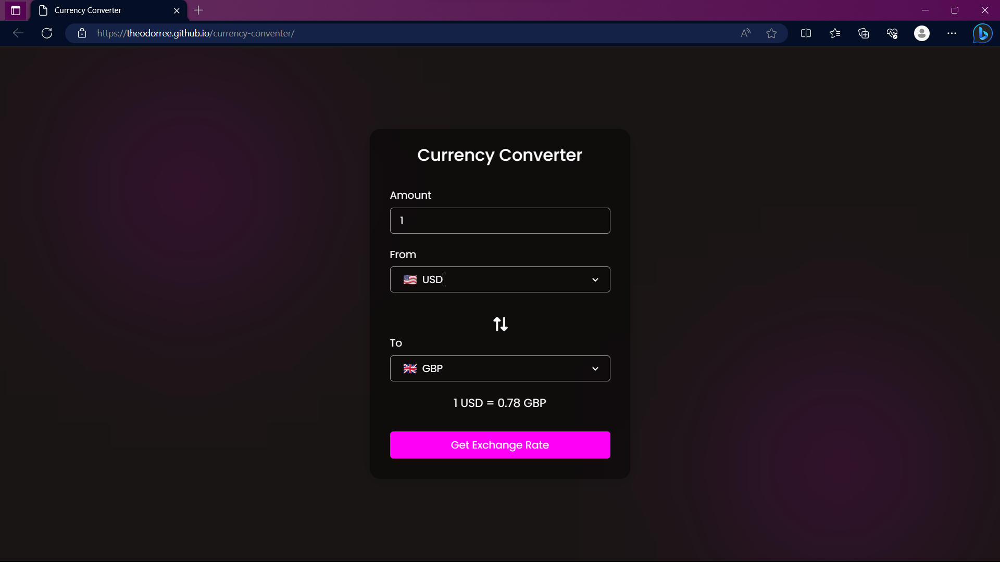

# Currency Converter

## Description

Currency Converter is a web application that allows users to convert between different currencies. The project is built using HTML, CSS, and JavaScript, and it utilizes exchange rate data to perform real-time currency conversions. It provides a simple and intuitive interface for users to input the amount, select the source currency, and choose the target currency for conversion.

## Features

- Convert between various currencies in real-time.
- Access up-to-date exchange rate data from reliable sources.
- Support for multiple currencies and accurate conversions.
- User-friendly interface with intuitive controls.

## Technologies Used

- HTML
- CSS
- JavaScript
- Fetch API (to fetch exchange rate data)

## Demo

You can see a live demo of the project [here](theodorree.github.io/currency-conventer/).
